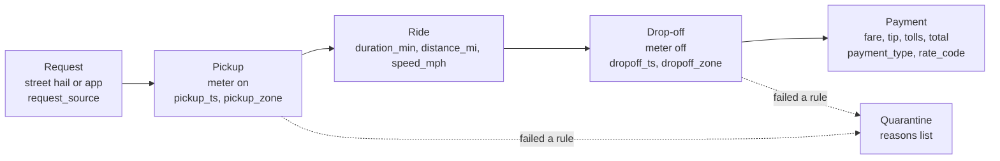
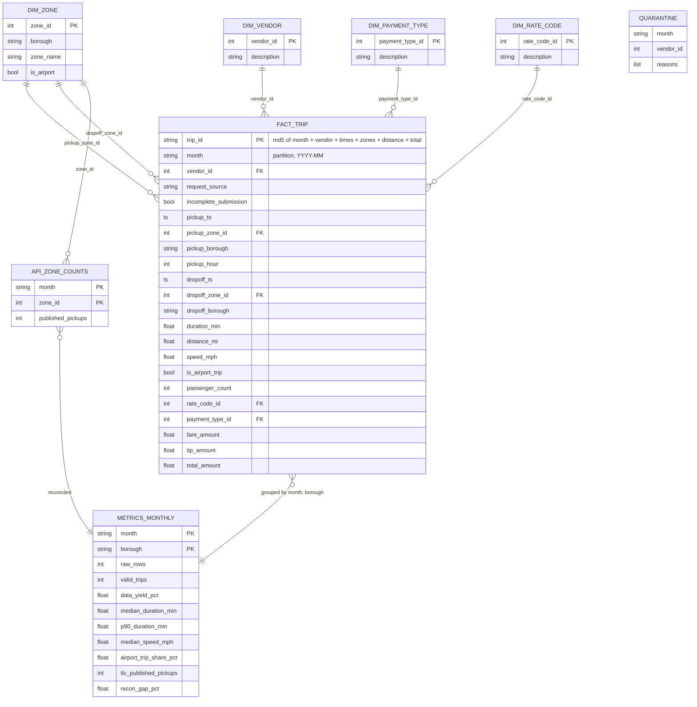

# Data model

## The trip as a workflow

The raw file is one wide table per month, organised by how vendors upload it. I
reorganised it around what actually happens in a trip.



Two events with timestamps (pickup, drop-off), the measures in between, and the
payment outcome. Rows that fail a rule are not thrown away, they move to the quarantine
state with their reasons.

## Tables



| Table | One row is | Key | Note |
|---|---|---|---|
| fact_trip | one valid trip | trip_id (hash) | TLC gives no natural id |
| quarantine | one rejected raw row | none | all original columns plus reasons |
| dim_zone | one taxi zone | zone_id | 265 rows including 264 Unknown and 265 Outside NYC |
| dim_vendor, dim_payment_type, dim_rate_code | one code | the code | labels from the TLC dictionary |
| api_zone_counts | month x zone | (month, zone_id) | yellow pickups from Open Data |
| metrics_monthly | month x borough, plus ALL NYC | (month, borough) | the output table |

Why not just mirror the source table: the source has no idea of "valid", mixes
lifecycle and payment and surcharge fields, and has no borough. This model separates
trusted rows from rejected ones, puts borough on both ends of the trip, and carries
TLC's published count next to ours so the trust gate is computed rather than claimed.

## Metrics and how they hang off the KPI

```
KPI        trusted monthly trips  (valid count, released only if yield >= 90% and gap <= 5%)
  outcome  valid_trips, data_yield_pct         how much of the month I can stand behind
  workflow median_duration_min, p90_duration_min   service time, meter on to meter off
  workflow median_speed_mph                    congestion proxy
  mix      airport_trip_share_pct              long airport trips push duration up
  trust    recon_gap_pct                       do we agree with TLC's own number
```

| Metric | Formula | Grain | Why |
|---|---|---|---|
| valid_trips | count of rows with empty reasons | month x borough | the KPI itself |
| data_yield_pct | valid / raw x 100 | month x borough | release gate; a drop means a vendor problem |
| median_duration_min | median(dropoff - pickup) | month x borough | what customers experience, robust to outliers |
| p90_duration_min | 90th percentile of duration | month x borough | the slow tail planners staff for |
| median_speed_mph | median(distance / hours) | month x borough | comparable congestion signal across months |
| airport_trip_share_pct | trips touching EWR/JFK/LGA / valid | month x borough | explains Queens' 33 min median |
| recon_gap_pct | (raw - published) / published x 100 | month x borough | release gate |

Controllable by operations: honestly none of these directly, this is regulator data.
What is controllable is the escalation: Helix drop-off times and the Vendor 1 May
resubmission both move yield and the reconciliation gap.

Missing event that limits the model most: a request / dispatch timestamp (no waiting
time) and a trip id (no proper duplicate tracking).
